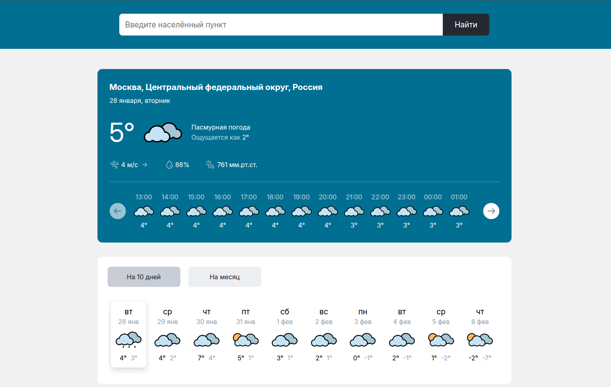
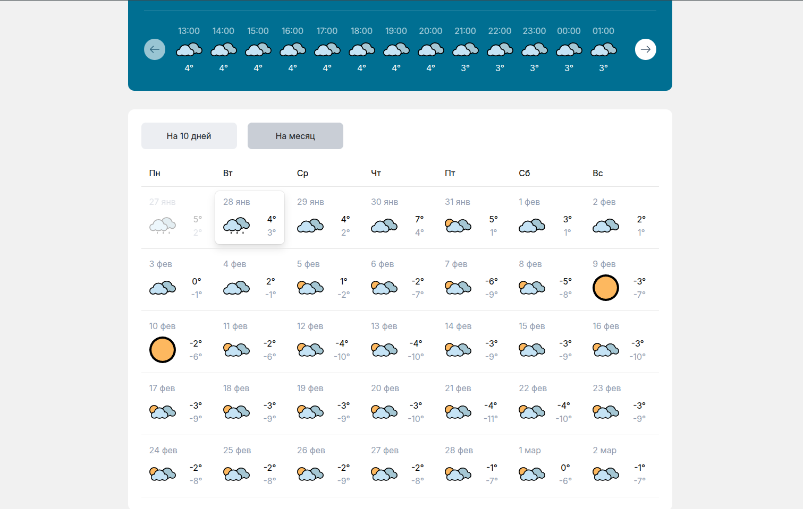

## [Демонстрация сайта](https://8gato8.github.io/weather-app/)

  
  

 

**Функционал:**

- Прогноз погоды на 10 или 30 дней (по выбору) для выбранного населённого пункта
- Прогноз погоды на выбранный день из списка

**Использованы следующие технологии:**

- Typescript
- HTML
- CSS
- Webpack

## Как запустить проект локально

`git clone git@github.com:8Gato8/weather-app.git` - клонировать репозиторий себе локально

`npm i` — установить пакеты

`npm run dev` — запустить сервер с hot-reload

## Ссылки

https://8gato8.github.io/weather-app/ - деплой проекта

## Статус проекта и планы по доработке

Завершён. Доработки не планируются.
